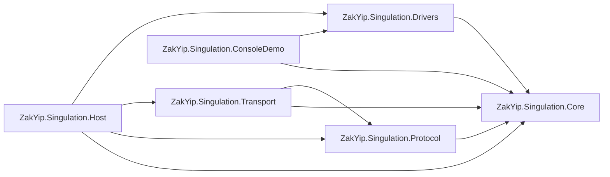

```
ZakYip.Singulation-master
├─ ZakYip.Singulation.Core
│  ├─ Configs/PlannerConfig.cs
│  ├─ Contracts/
│  │  ├─ Dto/{ConveyorTopology.cs, PlannerParams.cs, SpeedSet.cs}
│  │  ├─ ISpeedPlanner.cs
│  │  └─ ValueObjects/{AxisId.cs, AxisRpm.cs, KinematicParams.cs, PprRatio.cs}
│  ├─ Enums/{PlannerStatus.cs, SourceFlags.cs, SpeedUnit.cs}
│  ├─ Planning/DefaultSpeedPlanner.cs
│  └─ ZakYip.Singulation.Core.csproj
│
├─ ZakYip.Singulation.Protocol
│  ├─ Abstractions/IUpstreamCodec.cs
│  ├─ Codecs/FastBinaryCodec.cs
│  ├─ Enums/{CodecFlags.cs, CodecResult.cs}
│  ├─ Security/Crc32.cs
│  └─ ZakYip.Singulation.Protocol.csproj
│
├─ ZakYip.Singulation.Transport
│  ├─ Abstractions/{IByteTransport.cs, IUpstreamReceiver.cs}
│  ├─ Enums/TransportStatus.cs
│  ├─ Tcp/
│  │  ├─ TcpByteTransport.cs
│  │  ├─ TcpClientByteTransport/{TcpClientByteTransport.cs, TouchClientByteTransport.cs}
│  │  ├─ TcpServerByteTransport/{TcpServerByteTransport.cs, TouchServerByteTransport.cs}
│  │  ├─ TcpClientOptions.cs
│  │  └─ TcpServerOptions.cs
│  └─ ZakYip.Singulation.Transport.csproj
│
├─ ZakYip.Singulation.Drivers
│  ├─ Abstractions/
│  │  ├─ Events/{AxisDisconnectedEventArgs.cs, AxisErrorEventArgs.cs, AxisSpeedFeedbackEventArgs.cs, DriverNotLoadedEventArgs.cs, EvState.cs}
│  │  ├─ IAxisDrive.cs
│  │  ├─ IDriveRegistry.cs
│  │  └─ Ports/IAxisPort.cs
│  ├─ Common/{AxisCommandQueue.cs, DriverOptions.cs, ProtocolMap.cs, SpanParser.cs}
│  ├─ Enums/DriverStatus.cs
│  ├─ Health/AxisHealthMonitor.cs
│  ├─ Leadshine/{LTDMC.cs, LTDMC.dll, LeadshineLtdmcAxisDrive.cs, LeadshineProtocolMap.cs}
│  ├─ Registry/DefaultDriveRegistry.cs
│  ├─ Resilience/{AxisDegradePolicy.cs, ConsecutiveFailCounter.cs}
│  └─ ZakYip.Singulation.Drivers.csproj
│
├─ ZakYip.Singulation.Host
│  ├─ Program.cs
│  ├─ Runtime/{IRuntimeStatusProvider.cs, RuntimeStatusProvider.cs}
│  ├─ Transports/RuntimeStatus.cs
│  ├─ Workers/SingulationWorker.cs
│  ├─ Worker.cs
│  ├─ appsettings.json (+ Development)
│  └─ ZakYip.Singulation.Host.csproj
│
├─ ZakYip.Singulation.ConsoleDemo
│  ├─ Program.cs
│  └─ ZakYip.Singulation.ConsoleDemo.csproj
│
└─ ZakYip.Singulation.sln

```




