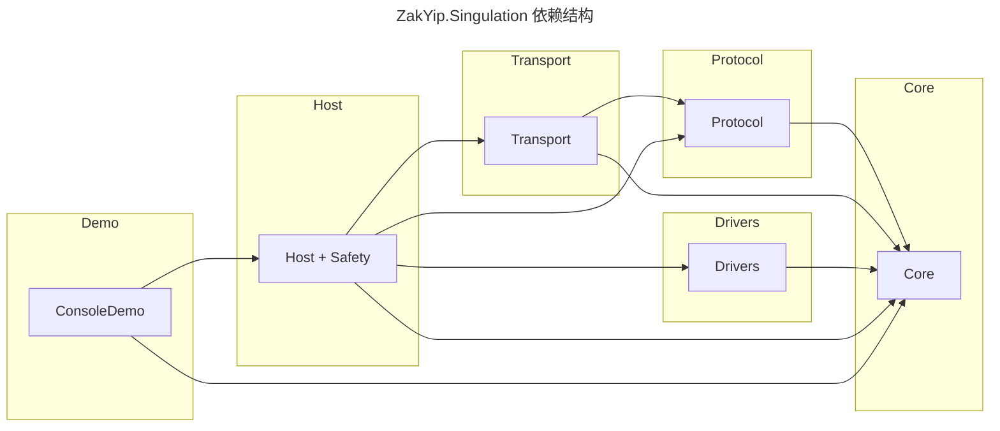

# ZakYip.Singulation 总览

## 本次更新

- 统一整理所有 record 定义，显式暴露属性注释并补充中文文档；拆分嵌套类型，落实“一文件一类”规范。
- 新增 `SafetyOperation`/`SignalRQueueItem`/`CommissioningCommand` 等独立类文件，消除内部类与匿名 record 的使用。
- 为安全/联机/DTO 等核心模型补充中文注释，并调整默认时间戳为 UTC，以提升日志可读性。
- 更新 README 结构树与进度说明，涵盖最新文件划分与后续优化建议。

## 项目结构与功能说明

```text
./
    .gitattributes
    .gitignore
    README.md
    ZakYip.Singulation.sln
    ZakYip.Singulation.ConsoleDemo/
        Program.cs
        ZakYip.Singulation.ConsoleDemo.csproj
        Regression/
            RegressionRunner.cs
    ZakYip.Singulation.Core/
        ZakYip.Singulation.Core.csproj
        Abstractions/
            Realtime/
                IRealtimeNotifier.cs
            Safety/
                FrameGuardDecision.cs
                ICommissioningSequence.cs
                IFrameGuard.cs
                ISafetyIoModule.cs
                ISafetyIsolator.cs
                ISafetyPipeline.cs
        Configs/
            AxisGridLayoutOptions.cs
            ControllerOptions.cs
            DriverOptionsTemplateOptions.cs
            PlannerConfig.cs
            UpstreamCodecOptions.cs
            UpstreamOptions.cs
            Defaults/
                ConfigDefaults.cs
        Contracts/
            IAxisLayoutStore.cs
            IControllerOptionsStore.cs
            ISpeedPlanner.cs
            IUpstreamCodecOptionsStore.cs
            IUpstreamFrameHub.cs
            IUpstreamOptionsStore.cs
            Dto/
                LinearPlannerParams.cs
                ParcelPose.cs
                SpeedSet.cs
                StatusSnapshot.cs
                SystemRuntimeStatus.cs
                TransportStatusItem.cs
                VisionParams.cs
            Events/
                AxisCommandIssuedEventArgs.cs
                AxisDisconnectedEventArgs.cs
                AxisErrorEventArgs.cs
                AxisEvent.cs
                AxisSpeedFeedbackEventArgs.cs
                BytesReceivedEventArgs.cs
                DriverNotLoadedEventArgs.cs
                EvState.cs
                LogEvent.cs
                TransportErrorEventArgs.cs
                TransportEvent.cs
                TransportStateChangedEventArgs.cs
                Safety/
                    SafetyStateChangedEventArgs.cs
                    SafetyTriggerEventArgs.cs
            ValueObjects/
                AxisId.cs
                AxisRpm.cs
                KinematicParams.cs
                PprRatio.cs
        Enums/
            AxisEventType.cs
            ControllerResetType.cs
            LogKind.cs
            PlannerStatus.cs
            SafetyCommand.cs
            SafetyIsolationState.cs
            SafetyTriggerKind.cs
            TransportConnectionState.cs
            TransportEventType.cs
            TransportRole.cs
            VisionAlarm.cs
        Planning/
            DefaultSpeedPlanner.cs
        Utils/
            FileUtils.cs
    ZakYip.Singulation.Drivers/
        ZakYip.Singulation.Drivers.csproj
        Abstractions/
            IAxisController.cs
            IAxisDrive.cs
            IAxisEventAggregator.cs
            IBusAdapter.cs
            IDriveRegistry.cs
            Ports/
                IAxisPort.cs
        Common/
            AxisController.cs
            AxisEventAggregator.cs
            DriverOptions.cs
            SpanParser.cs
        Enums/
            DriverStatus.cs
        Health/
            AxisHealthMonitor.cs
        Leadshine/
            LTDMC.cs
            LTDMC.dll
            LeadshineLtdmcAxisDrive.cs
            LeadshineLtdmcBusAdapter.cs
            LeadshineProtocolMap.cs
        Registry/
            DefaultDriveRegistry.cs
        Resilience/
            AxisDegradePolicy.cs
            ConsecutiveFailCounter.cs
    ZakYip.Singulation.Host/
        Nlog.config
        Program.cs
        ZakYip.Singulation.Host.csproj
        appsettings.Development.json
        appsettings.json
        install.bat
        signalr.ts
        singulation-log.db
        singulation.db
        unstall.bat
        Controllers/
            AdminController.cs
            AxesController.cs
            DecoderController.cs
            UpstreamController.cs
        Dto/
            ApiResponse.cs
            AxisCommandResultDto.cs
            AxisPatchRequestDto.cs
            AxisResponseDto.cs
            BatchCommandResponseDto.cs
            ControllerResetRequestDto.cs
            ControllerResponseDto.cs
            DecodeRequest.cs
            DecodeResult.cs
            SetSpeedRequestDto.cs
            UpstreamConnectionDto.cs
            UpstreamConnectionsDto.cs
        Extensions/
            SignalRSetup.cs
        Filters/
            ValidateModelFilter.cs
        Properties/
            launchSettings.json
        Runtime/
            IRuntimeStatusProvider.cs
            LogEventBus.cs
            PowerGuard.cs
            RealtimeDispatchService.cs
            RuntimeStatusProvider.cs
            UpstreamFrameHub.cs
        Safety/
            DefaultCommissioningSequence.cs
            FrameGuard.cs
            FrameGuardOptions.cs
            LoopbackSafetyIoModule.cs
            SafetyOperation.cs
            SafetyOperationKind.cs
            SafetyPipeline.cs
        SignalR/
            SignalRQueueItem.cs
            SignalRRealtimeNotifier.cs
            Hubs/
                EventsHub.cs
        SwaggerOptions/
            ConfigureSwaggerOptions.cs
            CustomOperationFilter.cs
            EnumSchemaFilter.cs
            HideLongListSchemaFilter.cs
            SwaggerGroupDiscovery.cs
        Workers/
            AxisBootstrapper.cs
            CommissioningCommand.cs
            CommissioningCommandKind.cs
            CommissioningState.cs
            CommissioningWorker.cs
            HeartbeatWorker.cs
            LogEventPump.cs
            LogsCleanupService.cs
            SingulationWorker.cs
            SpeedFrameWorker.cs
            TransportEventPump.cs
    ZakYip.Singulation.Infrastructure/
        ZakYip.Singulation.Infrastructure.csproj
        Configs/
            Entities/
                AxisGridLayoutDoc.cs
                ControllerOptionsDoc.cs
                DriverOptionsTemplateDoc.cs
                UpstreamCodecOptionsDoc.cs
                UpstreamOptionsDoc.cs
            Mappings/
                ConfigMappings.cs
        Persistence/
            LiteDbAxisLayoutStore.cs
            LiteDbControllerOptionsStore.cs
            PersistenceServiceCollectionExtensions.cs
        Safety/
            SafetyIsolator.cs
        Telemetry/
            SingulationMetrics.cs
        Transport/
            LiteDbUpstreamCodecOptionsStore.cs
            LiteDbUpstreamOptionsStore.cs
            TransportPersistenceExtensions.cs
            UpstreamTcpInjection.cs
    ZakYip.Singulation.Protocol/
        ZakYip.Singulation.Protocol.csproj
        Abstractions/
            IUpstreamCodec.cs
        Enums/
            CodecFlags.cs
            CodecResult.cs
            UpstreamCtrl.cs
        Vendors/
            Guiwei/
                GuiweiCodec.cs
                GuiweiControl.cs
                homing_only_tcp.md
            Huarary/
                HuararyCodec.cs
                HuararyControl.cs
                vision_mock_packets.md
    ZakYip.Singulation.Transport/
        ZakYip.Singulation.Transport.csproj
        Abstractions/
            IByteTransport.cs
            IUpstreamReceiver.cs
        Enums/
            TransportStatus.cs
        Tcp/
            TcpClientOptions.cs
            TcpServerOptions.cs
            TcpClientByteTransport/
                TouchClientByteTransport.cs
            TcpServerByteTransport/
                TouchServerByteTransport.cs
    ops/
        README.md
        dryrun.ps1
        dryrun.sh
        install.ps1
        install.sh
        selfcheck.ps1
        selfcheck.sh
        uninstall.ps1
        uninstall.sh
```

## 项目完成度

- 核心：安全联动（SafetyPipeline/SafetyIsolator）、联机流程（CommissioningWorker）、驱动封装与速度规划链路均已可用，具备基础产线运行能力。
- 配套：提供 ConsoleDemo、运维脚本、结构化指标，适合离线回归与部署自检。
- 待补：部分 Demo/驱动仍依赖模拟数据，真实硬件联调与多厂商扩展尚待集成。

## 关键模块说明

- **SafetyPipeline + SafetyIsolator**：串联安全 IO（启动/停止/急停/复位）和驱动健康事件，统一广播状态变化并自动触发 `IAxisController.StopAllAsync`。 
- **FrameGuard**：对速度帧执行序号滑窗、降级缩放与心跳监控；心跳超时会触发降级，恢复后自动切回。 
- **CommissioningWorker**：实现“上电→回零→对位→待命/故障落 SAFE”的状态机，与 SafetyPipeline 联动。 
- **SingulationMetrics**：通过 `System.Diagnostics.Metrics` 提供帧耗时、速度差、降级计数、RTT 等指标。 
- **Regression Runner**：`dotnet run --project ZakYip.Singulation.ConsoleDemo -- --regression` 可在无硬件环境下复现启动/降级流程。 
- **ops 脚本**：快速执行发布、自检、试跑；详见 `ops/README.md`。

## 指标与监控

| 指标 | 说明 |
| --- | --- |
| `singulation_frame_loop_ms` | SpeedFrameWorker 单帧处理耗时 |
| `singulation_frame_rtt_ms` | 帧时间戳到执行的 RTT |
| `singulation_speed_delta_mmps` | 降级缩放带来的速度差 |
| `singulation_degrade_total` | 降级/隔离触发计数（标签区分状态） |
| `singulation_axis_fault_total` | 轴故障触发次数 |
| `singulation_heartbeat_timeout_total` | 心跳超时触发次数 |
| `singulation_commissioning_ms` | 上电顺序机用时 |

## 运维脚本入口

```bash
# 自检
pwsh ops/selfcheck.ps1
# 或
./ops/selfcheck.sh

# 生成发布目录
pwsh ops/install.ps1 -PublishDir publish/host

# 回归试跑
pwsh ops/dryrun.ps1
# 或
./ops/dryrun.sh
```

## 可继续完善

- 引入真实硬件 IO 模块，替换 `LoopbackSafetyIoModule`，并补全异常自检逻辑。
- 在降级状态下引入渐进式限速而非 StopAll，支持自动速度恢复策略与多档降级。
- 结合 Prometheus/OTLP 将 `SingulationMetrics` 暴露到观测平台，完善报警策略。
- 扩展 `RegressionRunner` 与 Host API 测试，覆盖多轴故障、断电恢复、批量命令等场景。


