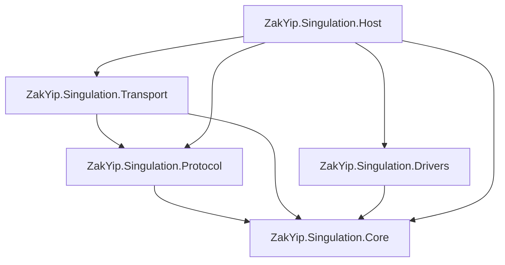

```
ZakYip.Singulation.sln

ZakYip.Singulation.Core/
├─ ZakYip.Singulation.Core.csproj
├─ ISpeedPlanner.cs
├─ Contracts/
│  ├─ Dto/
│  │  ├─ ConveyorTopology.cs
│  │  ├─ PlannerParams.cs
│  │  └─ SpeedSet.cs
│  └─ ValueObjects/
│     ├─ AxisId.cs
│     └─ AxisRpm.cs
└─ Enums/
   ├─ PlannerStatus.cs
   ├─ SourceFlags.cs
   └─ SpeedUnit.cs

ZakYip.Singulation.Protocol/
├─ ZakYip.Singulation.Protocol.csproj
├─ IUpstreamCodec.cs
└─ Enums/
   ├─ CodecFlags.cs
   └─ CodecResult.cs

ZakYip.Singulation.Transport/
├─ ZakYip.Singulation.Transport.csproj
├─ IByteTransport.cs
├─ IUpstreamReceiver.cs
└─ Enums/
   └─ TransportStatus.cs

ZakYip.Singulation.Drivers/
├─ ZakYip.Singulation.Drivers.csproj
├─ IAxisDrive.cs
├─ IDriveRegistry.cs
└─ Enums/
   └─ DriverStatus.cs

ZakYip.Singulation.Host/
├─ ZakYip.Singulation.Host.csproj
├─ Program.cs
├─ Worker.cs
├─ IRuntimeStatusProvider.cs
├─ Transports/
│  └─ RuntimeStatus.cs
├─ appsettings.json
├─ appsettings.Development.json
└─ Properties/
   └─ launchSettings.json


```




