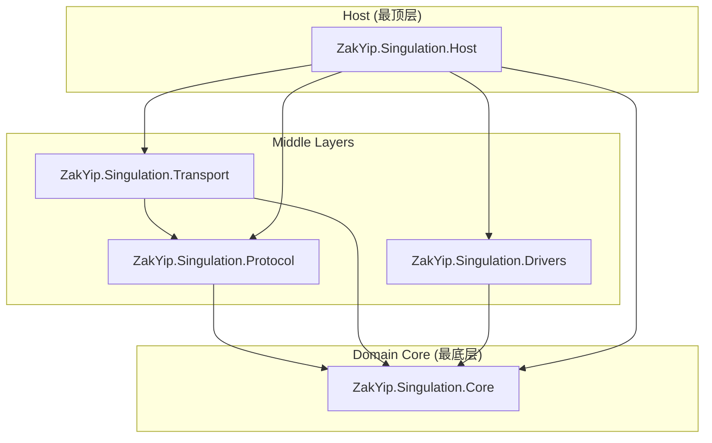

```
ZakYip.Singulation-master
├─ ZakYip.Singulation.Core
│  ├─ Configs/
│  │  └─ PlannerConfig.cs
│  ├─ Contracts/
│  │  ├─ Dto/
│  │  │  ├─ ConveyorTopology.cs
│  │  │  ├─ PlannerParams.cs
│  │  │  └─ SpeedSet.cs
│  │  └─ ValueObjects/
│  │     ├─ AxisId.cs
│  │     └─ AxisRpm.cs
│  │  └─ ISpeedPlanner.cs
│  ├─ Enums/
│  │  ├─ PlannerStatus.cs
│  │  └─ SourceFlags.cs
│  └─ Planning/
│     └─ DefaultSpeedPlanner.cs
│
├─ ZakYip.Singulation.Protocol
│  ├─ Abstractions/
│  │  └─ IUpstreamCodec.cs
│  ├─ Codecs/
│  │  └─ FastBinaryCodec.cs
│  ├─ Enums/
│  │  ├─ CodecFlags.cs
│  │  └─ CodecResult.cs
│  └─ Security/
│     └─ Crc32.cs
│
├─ ZakYip.Singulation.Transport
│  ├─ Abstractions/
│  │  ├─ IByteTransport.cs
│  │  └─ IUpstreamReceiver.cs
│  ├─ Enums/
│  │  └─ TransportStatus.cs
│  └─ Tcp/
│     ├─ TcpByteTransport.cs
│     ├─ TcpClientOptions.cs
│     ├─ TcpServerOptions.cs
│     ├─ TcpClientByteTransport/
│     │  ├─ TcpClientByteTransport.cs
│     │  └─ TouchClientByteTransport.cs
│     └─ TcpServerByteTransport/
│        ├─ TcpServerByteTransport.cs
│        └─ TouchServerByteTransport.cs
│
├─ ZakYip.Singulation.Drivers
│  ├─ Enums/
│  │  └─ DriverStatus.cs
│  ├─ Leadshine/
│  │  └─ LeadshineAxisDrive.cs
│  ├─ Registry/
│  │  └─ DefaultDriveRegistry.cs
│  ├─ Simulated/
│  │  └─ SimAxisDrive.cs
│  ├─ IAxisDrive.cs
│  └─ IDriveRegistry.cs
│
├─ ZakYip.Singulation.Host
│  ├─ Runtime/
│  │  ├─ IRuntimeStatusProvider.cs
│  │  └─ RuntimeStatusProvider.cs
│  ├─ Transports/
│  │  └─ RuntimeStatus.cs
│  ├─ Workers/
│  │  └─ SingulationWorker.cs
│  ├─ Program.cs
│  ├─ Worker.cs
│  └─ appsettings*.json
│
├─ README.md
└─ ZakYip.Singulation.sln

```




