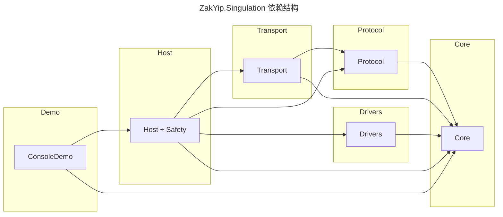

# ZakYip.Singulation 总览

## 本次更新

- 新增安全链路：`SafetyIsolator`、`SafetyPipeline`、`FrameGuard` 以及 `CommissioningWorker`，打通 IO → 隔离 → StopAll 的闭环，并支持心跳降级/恢复。 
- 新增结构化指标（`SingulationMetrics`）记录帧循环耗时、速度差、降级次数等核心指标。
- ConsoleDemo 支持 `--regression` 回归脚本，模拟“启动→三档→停机→恢复→断连→降级→恢复”。
- 新增 `ops/` 运维脚本套件（安装/卸载/自检/试跑）及上线手册。

## 项目结构与功能说明

```text
ZakYip.Singulation/
├─ ops/                                # 运维脚本与上线手册
│  ├─ install.(ps1|sh)                 # 发布 Host 二进制
│  ├─ uninstall.(ps1|sh)               # Windows 服务卸载（Linux 提示）
│  ├─ selfcheck.(ps1|sh)               # dotnet build 自检
│  ├─ dryrun.(ps1|sh)                  # Console 回归脚本
│  └─ README.md                        # 上线手册
├─ ZakYip.Singulation.Core/
│  ├─ Abstractions/
│  │  ├─ Realtime/IRealtimeNotifier.cs
│  │  └─ Safety/                       # 新增安全相关接口
│  │     ├─ IFrameGuard.cs
│  │     ├─ ICommissioningSequence.cs
│  │     ├─ ISafetyIoModule.cs
│  │     ├─ ISafetyIsolator.cs
│  │     └─ ISafetyPipeline.cs
│  ├─ Contracts/
│  │  ├─ Events/
│  │  │  ├─ Safety/                    # 安全事件参数
│  │  │  │  ├─ SafetyStateChangedEventArgs.cs
│  │  │  │  └─ SafetyTriggerEventArgs.cs
│  │  │  └─ (Axis/Transport/...)
│  │  └─ Dto/SpeedSet.cs 等
│  ├─ Enums/                           # 新增安全枚举
│  │  ├─ SafetyCommand.cs
│  │  ├─ SafetyIsolationState.cs
│  │  └─ SafetyTriggerKind.cs
│  └─ ...
├─ ZakYip.Singulation.Infrastructure/
│  ├─ Safety/SafetyIsolator.cs         # 默认隔离器实现
│  └─ Telemetry/SingulationMetrics.cs  # Prom/结构化指标入口
├─ ZakYip.Singulation.Host/
│  ├─ Safety/
│  │  ├─ FrameGuard.cs                 # 帧滑窗+心跳降级
│  │  ├─ FrameGuardOptions.cs
│  │  ├─ LoopbackSafetyIoModule.cs     # 内存 IO 模块（回归/开发）
│  │  └─ DefaultCommissioningSequence.cs
│  ├─ Workers/
│  │  ├─ CommissioningWorker.cs        # 上电顺序机状态机
│  │  ├─ SpeedFrameWorker.cs           # 接入 FrameGuard + 指标
│  │  └─ ...
│  ├─ Program.cs                       # 注册安全链路/指标/回归
│  └─ ...
├─ ZakYip.Singulation.ConsoleDemo/
│  ├─ Regression/RegressionRunner.cs   # 最小回归脚本
│  └─ Program.cs (支持 --regression)
├─ ZakYip.Singulation.Drivers/
│  ├─ Common/AxisController.cs 等
│  └─ ...
├─ ZakYip.Singulation.Transport/
├─ ZakYip.Singulation.Protocol/
└─ ZakYip.Singulation.sln
```

## 关键模块说明

- **SafetyPipeline + SafetyIsolator**：串联安全 IO（启动/停止/急停/复位）和驱动健康事件，统一广播状态变化并自动触发 `IAxisController.StopAllAsync`。 
- **FrameGuard**：对速度帧执行序号滑窗、降级缩放与心跳监控；心跳超时会触发降级，恢复后自动切回。 
- **CommissioningWorker**：实现“上电→回零→对位→待命/故障落 SAFE”的状态机，与 SafetyPipeline 联动。 
- **SingulationMetrics**：通过 `System.Diagnostics.Metrics` 提供帧耗时、速度差、降级计数、RTT 等指标。 
- **Regression Runner**：`dotnet run --project ZakYip.Singulation.ConsoleDemo -- --regression` 可在无硬件环境下复现启动/降级流程。 
- **ops 脚本**：快速执行发布、自检、试跑；详见 `ops/README.md`。

## 指标与监控

| 指标 | 说明 |
| --- | --- |
| `singulation_frame_loop_ms` | SpeedFrameWorker 单帧处理耗时 |
| `singulation_frame_rtt_ms` | 帧时间戳到执行的 RTT |
| `singulation_speed_delta_mmps` | 降级缩放带来的速度差 |
| `singulation_degrade_total` | 降级/隔离触发计数（标签区分状态） |
| `singulation_axis_fault_total` | 轴故障触发次数 |
| `singulation_heartbeat_timeout_total` | 心跳超时触发次数 |
| `singulation_commissioning_ms` | 上电顺序机用时 |

## 运维脚本入口

```bash
# 自检
pwsh ops/selfcheck.ps1
# 或
./ops/selfcheck.sh

# 生成发布目录
pwsh ops/install.ps1 -PublishDir publish/host

# 回归试跑
pwsh ops/dryrun.ps1
# 或
./ops/dryrun.sh
```

## 可继续完善

- 引入真实硬件 IO 模块，替换 `LoopbackSafetyIoModule`。 
- 在降级状态下引入渐进式限速而非 StopAll，支持自动速度恢复策略。 
- 结合 Prometheus/OTLP 将 `SingulationMetrics` 暴露到观测平台。 
- 扩展 `RegressionRunner`，覆盖更多异常场景（如多轴故障、重连成功）。


